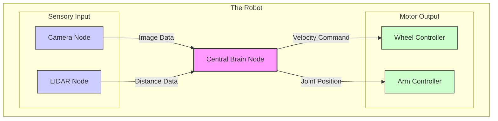

import PersonalizedContent from '@site/src/components/PersonalizedContent';

# The Robotic Nervous System

<PersonalizedContent 
  software={
    "**For Software Engineers:** Think of ROS 2 as a microservices architecture. Nodes are containers, and Topics are the Pub/Sub message bus (like Kafka)."
  }
  hardware={
    "**For Hardware Engineers:** Think of ROS 2 as the wiring harness. Nodes are the ECUs (Electronic Control Units), and Topics are the CAN bus signals."
  }
/>

To build a robot, we must first understand its nervous system. In the world of robotics, this nervous system is called **ROS 2** (Robot Operating System 2).

## ROS 2: Not an Operating System

Despite its name, the **Robot Operating System (ROS 2)** is not an operating system like Windows or Linux. It is **middleware**.

Think of your computer's OS as the body's baseline physiology—it keeps the blood pumping and the organs alive. ROS 2, on the other hand, is the **nervous system**. It provides the pathways for signals to travel between the brain (high-level logic), the senses (cameras, LIDAR), and the muscles (motors, servos).

## The Biological Analogy

To understand how to architect a robot, we will use the human body as our primary analogy.

| Biological Component | Robotic Counterpart | Function |
| :--- | :--- | :--- |
| **Brain** | High-Level Logic / Planners | Makes decisions, pathfinding, task scheduling. |
| **Nerves** | **Topics** & **Services** | Transmits data (pain, temperature, motor commands) between parts. |
| **Neurons / Reflexes** | **Nodes** | Small, independent processing units. One calculates balance, another processes vision. |
| **Senses** | Sensors (Camera, IMU) | Inputs raw data from the world. |
| **Muscles** | Actuators / Controllers | Executes physical movement. |

## Architecture Diagram

In a biological system, the brain doesn't manually control every single muscle fiber. It sends a "walk" command, and local nerve clusters (ganglia) handle the coordination. Similarly, in ROS 2, we have a **Central Node** (or a few high-level nodes) communicating with specialized **Sensor** and **Actuator** nodes.

## Why This Matters

This "distributed" approach means your robot is resilient. If the camera breaks (the "eye" node crashes), the rest of the robot (the "walking" nodes) can keep running. In this module, we will build these individual "neurons" and connect them to form a simple nervous system.