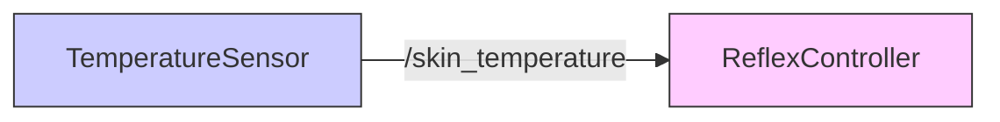

# Signals & Synapses (Topics)

If Nodes are neurons, **Topics** are the synapses—the gaps where signals jump from one neuron to another.

## The Publisher / Subscriber Model

In ROS 2, nodes don't usually talk directly to each other (like calling a specific phone number). Instead, they use a **Publisher/Subscriber** model, which is like radio broadcasting.

-   **Publisher (Broadcaster):** "I am shouting out the current temperature! Anyone listening?"
-   **Subscriber (Listener):** "I am listening to the 'temperature' channel."

This allows for loose coupling. The temperature sensor doesn't care *who* is listening, or if *anyone* is listening. It just does its job.

## Practical: A Temperature Reflex Arc

Let's build a simple reflex arc. We'll have a **Sensor Node** that simulates heat, and a **Control Node** that reacts when things get too hot.

### 1. The Sensor Node (Publisher)

This node publishes a random float number to a topic named `/skin_temperature`.

```python title="sensor_node.py"
import rclpy
from rclpy.node import Node
from std_msgs.msg import Float32
import random

class TemperatureSensor(Node):
    def __init__(self):
        super().__init__('temp_sensor')
        
        # Create a Publisher
        # Topic name: 'skin_temperature'
        # Message type: Float32
        # Queue size: 10
        self.publisher_ = self.create_publisher(Float32, 'skin_temperature', 10)
        
        self.timer = self.create_timer(1.0, self.publish_temp)
        self.get_logger().info('Temperature Sensor Active')

    def publish_temp(self):
        msg = Float32()
        # Simulate temp between 20.0 and 50.0 degrees Celsius
        msg.data = random.uniform(20.0, 50.0)
        
        self.publisher_.publish(msg)
        self.get_logger().info(f'Publishing: {msg.data:.2f} C')

def main(args=None):
    rclpy.init(args=args)
    node = TemperatureSensor()
    rclpy.spin(node)
    node.destroy_node()
    rclpy.shutdown()

if __name__ == '__main__':
    main()
```

### 2. The Control Node (Subscriber)

This node listens to `/skin_temperature`. If the value exceeds 40.0, it triggers a "Reflex".

```python title="control_node.py"
import rclpy
from rclpy.node import Node
from std_msgs.msg import Float32

class ReflexController(Node):
    def __init__(self):
        super().__init__('reflex_controller')
        
        # Create a Subscriber
        self.subscription = self.create_subscription(
            Float32,
            'skin_temperature',
            self.listener_callback,
            10)
        self.subscription  # prevent unused variable warning

    def listener_callback(self, msg):
        current_temp = msg.data
        if current_temp > 40.0:
            self.get_logger().warn(f'PAIN! High Temp: {current_temp:.2f} C - WITHDRAWING ARM!')
        else:
            self.get_logger().info(f'Temp normal: {current_temp:.2f} C')

def main(args=None):
    rclpy.init(args=args)
    node = ReflexController()
    rclpy.spin(node)
    node.destroy_node()
    rclpy.shutdown()

if __name__ == '__main__':
    main()
```

## Visualizing the Flow

When you run both scripts in separate terminals, you have created this data flow:



1.  **Terminal 1**: `python3 sensor_node.py`
2.  **Terminal 2**: `python3 control_node.py`

You will see the Controller reacting to the random data generated by the Sensor. This is the fundamental building block of all robotic behavior.