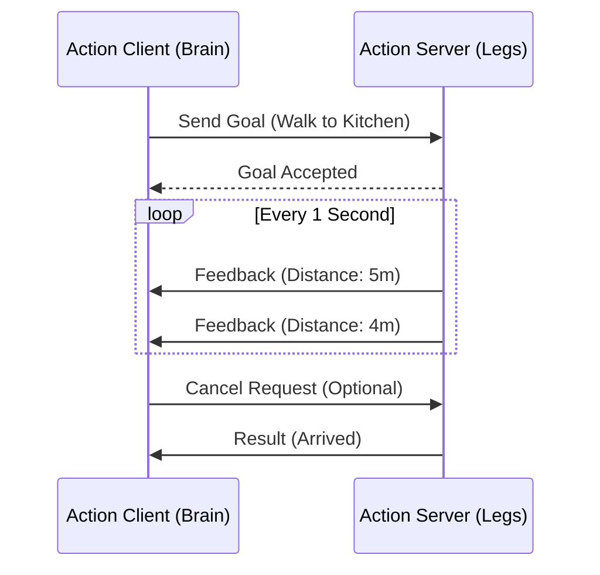

# Long-Running Tasks (Actions)

In Module 1, we learned about **Services** (Request -> Response). Services are like a function call: you ask for something, and you wait until you get the answer. This works great for "Turn on LED" or "Get Battery Level."

But what about "Walk to the Kitchen"? This might take 30 seconds. If you used a Service, your program would freeze for 30 seconds waiting for a reply. If the robot fell over halfway, you wouldn't know until the end.

**Actions** are designed for these long-running tasks.

## The Analogy

*   **Service:** Switching on a light. You flip the switch (Request), and the light turns on (Response). It's instant.
*   **Action:** Ordering a custom pizza.
    1.  **Goal:** You order a "Large Pepperoni" (Start).
    2.  **Feedback:** The tracker says "Preparing...", then "Baking...", then "Out for delivery..." (Updates).
    3.  **Result:** The pizza arrives at your door (Completion).
    4.  **Cancel:** You can call and cancel the order if it's taking too long.

## Architecture

An Action consists of three distinct parts:
1.  **Goal:** The target to achieve (e.g., `TargetLocation: Kitchen`).
2.  **Feedback:** Periodic updates (e.g., `DistanceRemaining: 2.5m`).
3.  **Result:** Final status (e.g., `Success: True`).



## Writing an Action Server

Here is a skeleton of a Node that implements an Action Server to "Walk" (simulated).

```python
import time
import rclpy
from rclpy.node import Node
from rclpy.action import ActionServer
from my_robot_interfaces.action import Walk  # Assuming this exists

class WalkActionServer(Node):

    def __init__(self):
        super().__init__('walk_action_server')
        self._action_server = ActionServer(
            self,
            Walk,
            'walk_to_target',
            self.execute_callback
        )

    def execute_callback(self, goal_handle):
        self.get_logger().info('Executing goal...')
        
        # Simulate the robot walking
        for i in range(1, 11):
            if goal_handle.is_cancel_requested:
                goal_handle.canceled()
                self.get_logger().info('Goal canceled')
                return Walk.Result()
            
            # Send Feedback
            feedback_msg = Walk.Feedback()
            feedback_msg.distance_remaining = 10.0 - i
            goal_handle.publish_feedback(feedback_msg)
            self.get_logger().info(f'Feedback: {feedback_msg.distance_remaining} meters left')
            
            time.sleep(1) # Simulate work

        goal_handle.succeed()
        
        result = Walk.Result()
        result.success = True
        return result

def main(args=None):
    rclpy.init(args=args)
    node = WalkActionServer()
    rclpy.spin(node)
```

This code allows the robot to process the "walking" logic while simultaneously keeping the rest of the system responsive.
