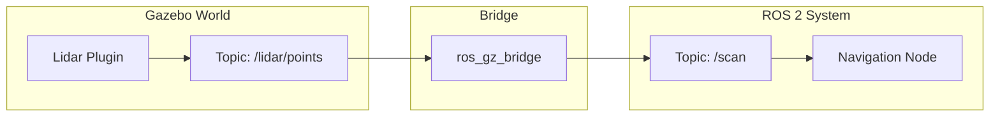

# Virtual Eyes & Ears (Sensors)

A simulation is only useful if the robot can perceive it. If we want to test our navigation algorithms, our simulated robot needs a simulated Lidar.

## Concept: Trickery

In the real world, a Lidar spins a mirror and fires laser pulses. In Gazebo, we don't simulate photons (that would be too slow). Instead, we use "Ray Casting" mathematics to calculate the distance to the nearest polygon.

## Adding Sensors to URDF

To add a sensor, we use the `<sensor>` tag inside a `<gazebo>` reference.

### 1. The Lidar (Ray Sensor)

```xml
<gazebo reference="lidar_link">
  <sensor name="lidar" type="gpu_lidar">
    <update_rate>10</update_rate> <!-- 10 Hz -->
    <ray>
      <scan>
        <horizontal>
          <samples>360</samples>
          <resolution>1</resolution>
          <min_angle>-3.14</min_angle>
          <max_angle>3.14</max_angle>
        </horizontal>
      </scan>
      <range>
        <min>0.10</min>
        <max>10.0</max>
      </range>
    </ray>
    <!-- The Plugin that does the work -->
    <plugin filename="libignition-gazebo-sensors-system.so" name="ignition::gazebo::systems::Sensors">
      <render_engine>ogre2</render_engine>
    </plugin>
  </sensor>
</gazebo>
```

### 2. The Camera (Image Sensor)

```xml
<gazebo reference="camera_link">
  <sensor name="camera" type="camera">
    <camera>
      <horizontal_fov>1.047</horizontal_fov>
      <image>
        <width>640</width>
        <height>480</height>
      </image>
    </camera>
    <plugin filename="libignition-gazebo-sensors-system.so" name="ignition::gazebo::systems::Sensors">
      <render_engine>ogre2</render_engine>
    </plugin>
  </sensor>
</gazebo>
```

## The Bridge: Connecting Worlds

Gazebo publishes sensor data on its own internal network (Ignition Transport). ROS 2 lives on a different network (DDS). We need a **Bridge** to connect them.



### Running the Bridge

We run the bridge as a ROS 2 node, passing it a configuration argument.

```bash
ros2 run ros_gz_bridge parameter_bridge /lidar/points@sensor_msgs/msg/LaserScan@ignition.msgs.LaserScan
```

**Deconstruct the argument:**
*   `/lidar/points`: The topic name in Gazebo.
*   `sensor_msgs/msg/LaserScan`: The ROS 2 message type we want.
*   `ignition.msgs.LaserScan`: The Gazebo message type coming in.

Once bridged, you can open RViz2 and see the walls of your virtual world!