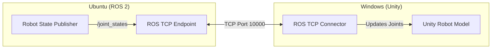

# The Pretty Face (Unity Visualization)

Gazebo is a scientific tool. Its graphics are "good enough" for debugging, but they aren't beautiful.
**Unity** is a Game Engine. It is designed to render beautiful worlds, handle VR/AR, and create user-friendly interfaces.

## The Concept: Visualization Only

In this workflow, **Unity is NOT doing the physics.**
*   **Gazebo** calculates gravity, collisions, and sensor data.
*   **ROS 2** handles the logic and control.
*   **Unity** simply listens to the ROS topics and draws the robot in the correct pose.

It is a "Puppet" controlled by the ROS "Puppeteer."

## Architecture

We connect ROS 2 and Unity using TCP/IP (Internet Protocol).



## Setup Guide

### 1. Unity Setup
1.  Install **Unity Hub** and a recent **Unity Editor (2021+)**.
2.  Create a new **3D Project**.
3.  Open the **Package Manager** and add the package from git:
    `https://github.com/Unity-Technologies/ROS-TCP-Connector.git?path=/com.unity.robotics.ros-tcp-connector`

### 2. ROS 2 Setup
We need a special node in ROS to talk to Unity.

```bash
sudo apt install ros-humble-ros-tcp-endpoint
ros2 run ros_tcp_endpoint default_server_endpoint --ros-args -p ROS_IP:=0.0.0.0
```

### 3. Importing the Robot
Unity cannot read URDF files natively. We use the **URDF Importer** tool.
1.  In Unity, go to `Assets -> Import Robot from URDF`.
2.  Select your `.urdf` file.
3.  Unity will generate a GameObject with all the meshes and link hierarchies.

## The Result
When you drive your robot in Gazebo (or run a movement script), the **ROS TCP Endpoint** sends the new joint angles to Unity. The Unity robot mirrors the movement instantly.

This setup is perfect for:
*   **Stakeholder Demos:** Show off your robot in a photorealistic apartment.
*   **AR/VR Interfaces:** Control your ROS robot using an Oculus Quest.
*   **Synthetic Data Generation:** Take pictures of the robot in Unity to train AI models.