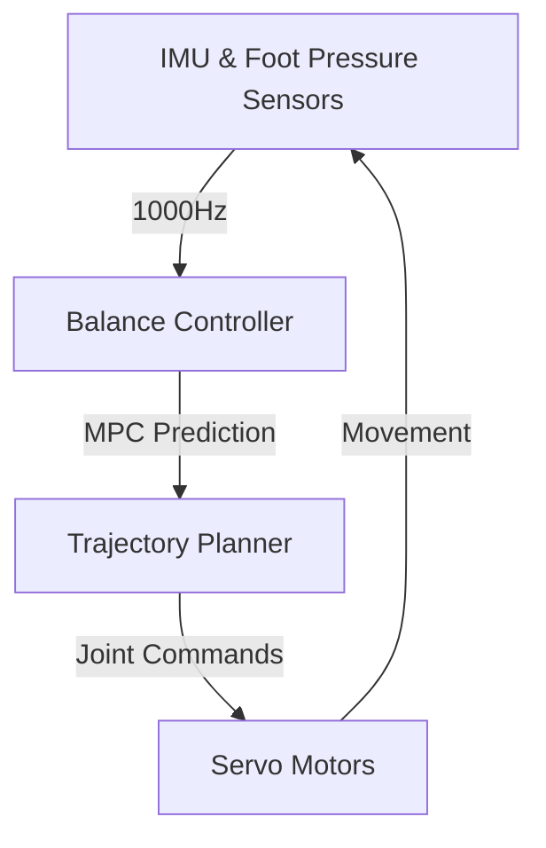

# The Art of Falling (Bipedal Walking)

Walking is a complex feat of engineering. For a humanoid, walking is essentially a state of **controlled falling**. Every step is a move to catch the body before it hits the ground.

## 1. The Zero Moment Point (ZMP)
How does a robot know it is about to fall? We use a concept called the **Zero Moment Point (ZMP)**.

### The Waiter Analogy
Imagine a **waiter carrying a heavy tray** full of drinks. 
*   If the waiter stands perfectly still, the weight of the tray pushes straight down through their feet.
*   If the waiter starts walking quickly or leans forward, the tray wants to tip. 
*   To keep the drinks from sliding or the tray from flipping, the waiter must adjust their stance so that the "net force" (the combination of gravity and their movement) stays directly over their feet.

**The ZMP is that point on the ground where all the forces acting on the robot are perfectly balanced.**
*   **Stable:** If the ZMP is inside the area covered by the robot's feet (the support polygon), the robot stays upright.
*   **Falling:** If the ZMP moves outside the feet (because the robot leaned too far or moved too fast), the robot will tip over.

## 2. Balance Technology

### Model Predictive Control (MPC)
Modern humanoids use **MPC** to stay balanced. Instead of reacting to a fall *after* it happens, the robot uses a mathematical model to "predict" the future. It calculates: "If I move my leg here, where will my center of mass be in 0.5 seconds?" It constantly adjusts its plan to keep the ZMP safe.

### The 1000Hz Loop
Balance requires incredible speed. `ros2_control` manages the communication with the motors. For a humanoid to stay upright, it often needs to send updates to its motors **1,000 times per second (1kHz)**. Even a micro-second of lag can result in a fallen robot.

:::important C++ vs Python
While much of ROS 2 can be written in Python, **real-time balance controllers must be written in C++**. Python's garbage collection and slower execution speed introduce "jitter" (random delays) that can cause a robot to lose its balance. We use Python for the high-level "mission logic" but C++ for the low-level "reflexes."
:::

In the next section, we look at how the robot uses its upper body to interact with objects.