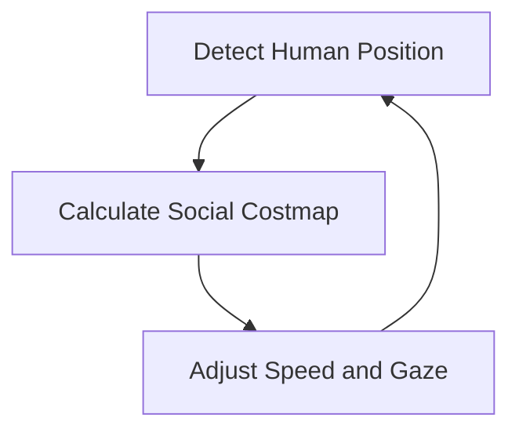

# Social Robotics (HRI)

Humanoid robots are designed to operate in human environments. This means they must follow social "rules" that we often take for granted. This field is called **Human-Robot Interaction (HRI)**.

## 1. Proxemics: Respecting Personal Space
How close should your robot get to a human?
*   **Public Space:** > 3.5 meters.
*   **Social Space:** 1.2 to 3.5 meters (for conversation).
*   **Personal Space:** 0.5 to 1.2 meters (friends/family).
*   **Intimate Space:** < 0.5 meters.

A robot that enters someone's "Intimate Space" without a specific reason (like handing them a tool) feels threatening. We program the navigation stack to treat the area around a human as a "virtual obstacle" that should be avoided.

## 2. Gaze and Joint Attention
If a robot is reaching for a cup but looking at the ceiling, it feels "broken" or "creepy."
**Joint Attention** is the act of the robot looking at the object it is interacting with. This signals to the human what the robot's intentions are. We use the "Look At" controller in MoveIt 2 to ensure the robot's head tracks its hands.

## 3. Safety: Velocity Scaling
Humanoids are heavy and powerful. To ensure safety, we implement **Velocity Scaling**:
*   The robot uses its cameras/Lidar to detect humans.
*   As a human gets closer, the robot automatically slows down its movements.
*   If a human enters the "Danger Zone" (Personal Space), the robot stops all motion immediately.

## 4. The HRI Control Loop

By following these social cues, we transform a "machine" into a "companion."