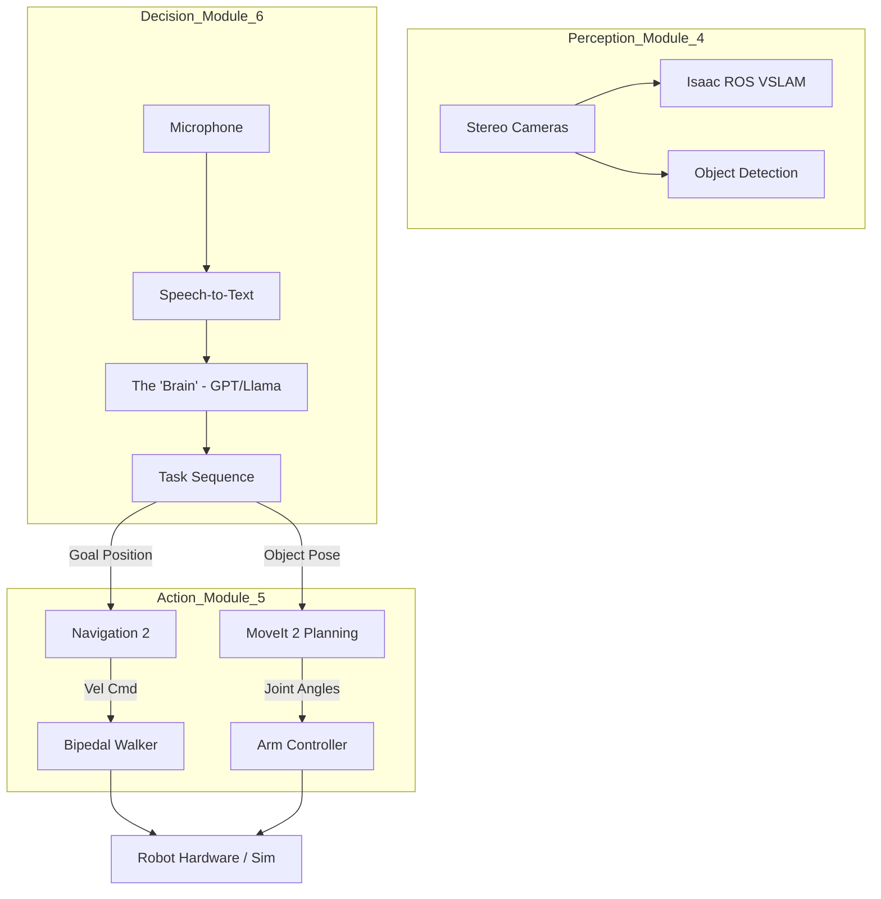

# Assembling the Avatar (The Capstone)

In this final section of Module 5, we look at how to integrate every technology we have learned so far into a single, cohesive "Robot Brain." This is the goal of the Physical AI course: creating an autonomous humanoid avatar.

## 1. The Integrated Control Loop
A functional humanoid doesn't just "run a script." It operates in a continuous loop of sensing, thinking, and acting.

1.  **HEAR:** The robot listens for a command (e.g., "Bring me the red tool") using OpenAI Whisper.
2.  **SEE:** The robot uses **Isaac ROS VSLAM** to know where it is and **Object Detection** (from Module 4) to find the tool.
3.  **THINK:** An **LLM (Large Language Model)** or **VLA (Vision-Language-Action)** model decides the steps: "First I must walk to the table, then reach for the tool."
4.  **WALK:** The **Nav2** stack and the **Locomotion Controller** (ZMP-based) move the robot to the table.
5.  **GRAB:** **MoveIt 2** plans the arm trajectory to grasp the tool without hitting the table.

## 2. System Architecture

Below is the "Big Picture" of our humanoid system.

## 3. Your Final Challenge
Your capstone project is to demonstrate this loop in the Isaac Sim environment. You will send a voice command and watch your humanoid navigate a warehouse, identify an object, and successfully manipulate it. 

You are no longer just a coder; you are a **Robotics Architect**.