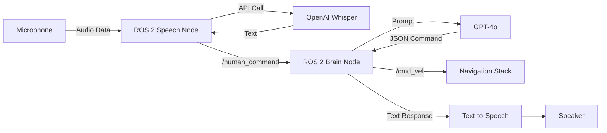

# The Voice Interface (VUI)

For decades, we have controlled robots with keyboards, gamepads, and touchscreens. But if humanoids are to integrate seamlessly into our homes, they must speak our language. This is the **Voice User Interface (VUI)**.

## 1. Why Voice?
*   **Hands-Free:** You can command a robot while carrying groceries.
*   **Intuitive:** No need to read a manual to know which button does what.
*   **Richness:** Voice conveys emotion and urgency ("Stop!" vs "Please stop").

## 2. The Conversational Pipeline
Building a talking robot involves a chain of complex AI models. We call this the **Audio-Intelligence-Action Loop**.

### The Latency Trap
The biggest challenge in conversational robotics is **Latency**.
1.  **Record Audio:** 3 seconds.
2.  **Upload to Cloud:** 0.5 seconds.
3.  **Transcribe (Whisper):** 1 second.
4.  **Think (GPT-4):** 2 seconds.
5.  **Synthesize Speech (TTS):** 1 second.
6.  **Download Audio:** 0.5 seconds.

**Total Delay:** ~8 seconds.
In a conversation, an 8-second pause is awkward. In a safety situation ("Stop!"), it is dangerous. We must optimize every step or use local inference where possible.

## 3. Architecture Diagram

Below is how this pipeline integrates into our ROS 2 system.

In this module, we will build each of these blocks, starting with the ears.